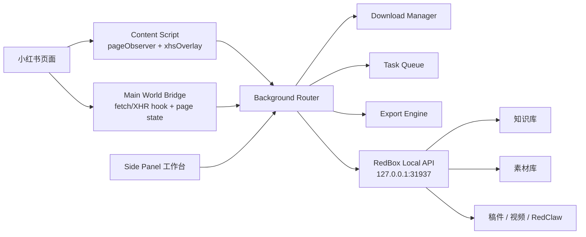

# RedBox 插件小红书采集工作台升级方案

## 目标

把当前 `RedBox Capture` 从“popup 保存器”升级为“浏览器侧边栏采集工作台 + 小红书页面内操作按钮 + RedBox 桌面端创作链路入口”。

升级后的插件应先完整覆盖小红书平台，后续再按同一架构扩展抖音、Bilibili、快手、TikTok。小红书版本不能只做单篇保存，必须形成完整产品闭环：

- 在小红书页面内注入 RedBox 操作按钮。
- 点击扩展图标打开 Chrome side panel，而不是 popup。
- 侧边栏支持当前笔记保存、素材下载、评论采集、博主采集、关键词/链接批量采集、任务队列、采集历史、字段配置和导出。
- 数据写入 RedBox 桌面端本地 API，继续服务知识库、素材库、稿件、视频和 RedClaw 创作链路。
- 核心采集在用户浏览器里完成，只访问小红书自己的网页接口和 RedBox 本地服务，不依赖第三方采集 API。

## 当前基线

当前 `Plugin/` 是一个轻量 MV3 插件：

| 文件 | 当前职责 | 升级影响 |
| --- | --- | --- |
| `Plugin/manifest.json` | popup、右键菜单、content script、RedBox 本地服务权限 | 改为 side panel 主入口，新增下载、cookie、站点权限和必要的 DNR 能力 |
| `Plugin/background.js` | 消息路由、右键菜单、更新检查、页面提取、写入知识库 | 需要拆分成消息路由、RedBox API、下载器、任务队列、采集执行器 |
| `Plugin/pageObserver.js` | 页面检测、小红书/抖音/YouTube 识别、图片拖拽保存 | 继续负责页面状态检测，新增小红书 DOM 注入入口 |
| `Plugin/pageRouteBridge.js` | 监听 SPA 路由变化 | 保留，作为页面状态刷新触发器 |
| `Plugin/popup.*` | popup UI | 迁移为 `sidepanel.*`，popup 可移除或仅做兼容跳转 |

当前已具备的小红书能力：

- 检测小红书详情页。
- 从 DOM、`window.__INITIAL_STATE__`、图片/视频节点、performance resource 中提取单篇笔记。
- 保存为 RedBox 知识库条目。

当前缺口：

- 没有侧边栏工作台。
- 没有页面内 DOM 注入下载按钮。
- 没有批量任务、字段配置、采集历史、Excel/CSV 导出。
- 没有评论、博主、搜索、专辑等完整采集链路。
- 没有统一的小红书 collector / task / schema 模块边界。

## 参考插件能力拆解

参考插件的能力可以归纳为五层：

| 层 | 能力 | 我们的取舍 |
| --- | --- | --- |
| 页面层 | DOM 注入、页面识别、RPA 滚动、展开评论、监听页面接口响应 | 必须做，且优先自研 |
| 采集层 | 笔记、评论、博主、搜索、专辑、素材下载 | 小红书第一批完整覆盖 |
| 工作台层 | 侧栏导航、任务表单、字段选择、任务进度、历史 | 必须做，但 UI 保持 RedBox 风格，避免冗余说明 |
| 输出层 | Excel、复制、下载、同步第三方表格、接口上报 | 第一版做下载、导出、写入 RedBox；飞书/自定义上报暂不作为 RedBox 插件主路径 |
| 账号/会员层 | 插件服务端登录、VIP、配置同步 | 不复制。RedBox 插件默认本地优先，不引入第三方账号体系 |

关键原则：

- 采集能力服务 RedBox 创作链路，不做孤立的数据工具。
- 浏览器插件只负责采集、下载、导出和提交结构化数据。
- AI 分析、选题、稿件、视频和 RedClaw 自动化由桌面端承接。

## 产品架构



推荐模块边界：

| 模块 | 目标文件 | 责任 |
| --- | --- | --- |
| Manifest | `Plugin/manifest.json` | 权限、side panel、content scripts、host permissions |
| Background router | `Plugin/background.js` 或 `Plugin/background/router.js` | 消息分发、旧入口兼容、错误归一化 |
| RedBox API | `Plugin/background/redboxApi.js` | healthcheck、知识库写入、素材写入、后续创作动作 |
| Download manager | `Plugin/background/downloads.js` | Chrome downloads、命名规则、并发、失败重试 |
| Task queue | `Plugin/background/taskQueue.js` | 批量任务、暂停继续、断点、历史 |
| XHS collector | `Plugin/xhs/collector.js` | 小红书统一采集入口 |
| XHS extractors | `Plugin/xhs/extractNote.js`、`extractUser.js`、`extractComment.js` | 笔记、博主、评论提取 |
| XHS API adapter | `Plugin/xhs/api.js` | 小红书 Web API 调用、分页、响应规范化 |
| XHS normalizer | `Plugin/xhs/normalize.js` | 统一字段、计数解析、URL 归一化、去重 |
| XHS schema | `Plugin/xhs/schema.js` | 字段定义、导出字段、RedBox 映射 |
| Main bridge | `Plugin/content/xhsMainBridge.js` | main world hook `fetch/XHR`、读取页面全局变量 |
| Overlay | `Plugin/content/xhsOverlay.js` | DOM 注入按钮、状态提示、页面内快捷动作 |
| Side panel | `Plugin/sidepanel.html`、`sidepanel.js`、`sidepanel.css` | 工作台 UI |
| Storage | `Plugin/storage/index.js` | `chrome.storage.local` + IndexedDB 统一封装 |
| Export | `Plugin/export/xlsx.js`、`csv.js` | Excel/CSV/JSON 导出 |

如果决定引入构建系统，推荐把 `Plugin/` 迁移为 WXT + React + TypeScript：

```text
Plugin/
  package.json
  wxt.config.ts
  entrypoints/
    background.ts
    sidepanel/
      index.html
      main.tsx
    content/
      pageObserver.ts
      xhsOverlay.ts
      xhsMainBridge.ts
  src/
    background/
    xhs/
    redbox/
    storage/
    export/
    ui/
```

如果短期不引入构建系统，可以保留原生 JS 文件，但必须先拆模块，避免继续扩大单个 `background.js`。

## 打开模式升级

`manifest.json` 目标调整：

```json
{
  "permissions": [
    "activeTab",
    "alarms",
    "contextMenus",
    "downloads",
    "scripting",
    "storage",
    "tabs",
    "sidePanel"
  ],
  "host_permissions": [
    "http://127.0.0.1:31937/*",
    "http://localhost:31937/*",
    "https://www.xiaohongshu.com/*",
    "https://www.rednote.com/*",
    "https://edith.xiaohongshu.com/*",
    "https://sns-webpic-qc.xhscdn.com/*",
    "https://sns-video-*.xhscdn.com/*"
  ],
  "side_panel": {
    "default_path": "sidepanel.html"
  },
  "action": {
    "default_title": "RedBox Capture"
  }
}
```

Background 启动时：

```js
chrome.sidePanel.setPanelBehavior({ openPanelOnActionClick: true });
```

保留右键菜单，但它不再是主入口。右键菜单只做快速保存：

- 保存当前页面到 RedBox。
- 保存选中文字到 RedBox。
- 保存图片到素材库。
- 保存当前小红书笔记。

## 小红书页面 DOM 注入

页面内注入采用 Shadow DOM，避免被小红书页面样式污染。

注入位置优先级：

1. 笔记详情页右侧操作区。
2. 视频/图文播放器旁边。
3. 如果找不到稳定容器，固定在页面右侧浮动工具条。

按钮设计：

| 按钮 | 显示条件 | 动作 |
| --- | --- | --- |
| 保存到 RedBox | 检测到当前笔记 | 提取当前笔记并写入知识库 |
| 下载素材 | 检测到图片或视频 URL | 下载当前笔记图片、视频、封面 |
| 采集评论 | 检测到笔记 ID | 打开 side panel，预填当前笔记评论采集任务 |
| 打开工作台 | 小红书任意页面 | 打开 side panel 并定位当前平台 |

页面内按钮只发送结构化消息，不直接做复杂逻辑：

```js
chrome.runtime.sendMessage({
  type: "xhs:download-current-note",
  source: "overlay",
  tabId,
});
```

## 采集能力矩阵

| 功能 | 输入 | 输出 | 第一数据源 | 降级策略 |
| --- | --- | --- | --- | --- |
| 当前笔记采集 | 当前详情页 | `XhsNoteRecord` | `__INITIAL_STATE__` + DOM | performance media URL + meta |
| 当前素材下载 | 当前详情页 | 图片/视频/封面文件 | state image/video list | DOM image/video + resource entries |
| 评论采集 | 笔记链接 / 当前笔记 | `XhsCommentRecord[]` | 页面接口响应缓存 | RPA 展开评论触发接口 |
| 子评论采集 | 评论采集配置 | 子评论列表 | 接口响应缓存 | 点击“展开更多” |
| 博主采集 | 博主链接 / 当前博主页 | `XhsUserRecord` | 用户页 state + API | DOM profile |
| 博主笔记列表 | 博主链接 + 数量 | `XhsNoteRecord[]` | 用户笔记分页 API | RPA 滚动主页 |
| 关键词笔记采集 | 关键词 + 筛选 + 数量 | `XhsNoteRecord[]` | 搜索 API | 打开搜索页 RPA 收集 |
| 关键词博主采集 | 关键词 + 数量 | `XhsUserRecord[]` | 搜索 API | DOM 搜索结果 |
| 专辑笔记采集 | 专辑页 / 专辑链接 | `XhsNoteRecord[]` | 专辑接口/页面 state | DOM 卡片列表 |

当前落地状态：

- `xhs:collect-blogger-notes` 已接入插件消息路由，当前博主页优先在页面上下文读取 `/api/sns/web/v1/user_posted`，并保留滚动主页采集链接的降级路径。
- 博主主页 DOM 按钮“采集主页笔记”和侧栏“采集当前博主”会复用同一条任务链，最终仍通过笔记详情页提取写入 RedBox，保证素材、正文、标题等字段完整。
- `xhsBridge.js` 已作为 MAIN world content script 加载到小红书 / RedNote 页面，缓存页面自身 fetch / XHR 返回的接口响应，博主笔记采集会优先复用其中的 `user_posted` 数据。
- `pageObserver.js` 现在提供右侧固定浮动采集面板，按笔记页、博主页、列表页重绘动作，避免只依赖小红书页面内部 DOM 容器导致按钮不可见。
- 批量采集已参考目标插件的 `min/max requestInterval` 模式落地：链接、当前页可见笔记、关键词、博主笔记都会串行执行，每条笔记之间按最小/最大秒数随机等待；侧栏可配置间隔，页面内 DOM 按钮使用后台默认间隔。
- `background.js` 已提供插件级小红书任务队列，保存、下载、评论、博主、博主笔记、链接批量、当前页批量、关键词批量都会进入统一队列；多个页面或多个侧栏同时触发任务时只会串行执行。
- `sidepanel.*` 顶部已展示当前执行任务、排队数量和最近完成状态，用于管理跨页面触发的采集任务。
- 页面右侧 Shadow DOM 浮动面板已扩展为全站统一入口：小红书显示采集动作，YouTube/抖音显示视频保存，公众号显示文章保存，普通网页显示网页保存和打开侧栏。

## 数据获取策略

小红书采集按三层执行，不直接把所有能力绑死到主动 API：

### 1. 页面状态优先

适用：

- 当前笔记详情。
- 当前博主页。
- 已打开的搜索结果。

读取对象：

- `window.__INITIAL_STATE__`
- 小红书页面 DOM
- `video`、`img`、`meta[property="og:*"]`
- `performance.getEntriesByType("resource")`

优点：

- 触发风控概率低。
- 实现简单。
- 对当前页保存和下载足够稳定。

### 2. 接口响应捕获

在 main world 中 hook：

- `window.fetch`
- `XMLHttpRequest.prototype.open`
- `XMLHttpRequest.prototype.send`

捕获对象：

- note detail
- comment list
- sub comment list
- user profile
- search notes
- search users
- user posted notes

捕获结果写入 content script 缓存，再转发 background：

```ts
type XhsCapturedResponse = {
  platform: "xiaohongshu";
  url: string;
  method: string;
  requestBody?: unknown;
  responseBody: unknown;
  capturedAt: number;
};
```

优点：

- 不需要一开始破解/复用签名。
- 用户浏览页面或 RPA 滚动时自然得到数据。
- 对评论和搜索尤其重要。

### 3. 主动 Web API 调用

只有以下场景主动调用：

- 批量链接采集。
- 批量关键词采集。
- 批量博主笔记列表。
- 评论分页缺失。
- 当前 state/DOM 信息不完整。

实现原则：

- 优先在页面上下文使用小红书已有请求能力。
- 如果需要签名，先复用页面已有函数；最后再考虑 DNR 替换小红书脚本。
- 所有 API 响应必须经过 `xhs/normalize.js`，不能直接泄漏平台原始结构到 RedBox。

## 侧边栏工作台

侧边栏信息架构：

```text
RedBox Capture
  小红书
    当前页面
      保存当前笔记
      下载当前素材
      采集当前评论
    批量采集
      笔记数据
      博主数据
      评论数据
      专辑笔记
    数据输出
      导出 Excel/CSV/JSON
      写入 RedBox
      创建创作素材包
    任务中心
      运行中
      已完成
      失败
    设置
      字段配置
      下载命名
      并发与间隔
```

侧边栏 UI 原则：

- 首屏直接是工作台，不做营销式首页。
- 当前页面被识别时，顶部显示当前笔记的标题、作者、类型和可用动作。
- 批量任务表单紧凑：输入、数量、模式、字段、开始按钮。
- 运行中任务显示进度、已采集数量、失败数量、暂停/继续/停止。
- 历史记录支持再次导出、再次写入 RedBox、复制任务配置。

## 任务模型

```ts
type XhsCollectTask = {
  id: string;
  platform: "xiaohongshu";
  taskType: "note" | "comment" | "user" | "user_notes" | "search_notes" | "search_users" | "board_notes";
  name: string;
  input: {
    urls?: string[];
    keywords?: string[];
    currentTab?: boolean;
    limit?: number;
    filters?: Record<string, unknown>;
  };
  mode: "page_state" | "captured_api" | "active_api" | "rpa";
  outputTargets: Array<"redbox_knowledge" | "redbox_assets" | "download" | "xlsx" | "csv" | "json">;
  fieldPresetId?: string;
  status: "queued" | "running" | "paused" | "completed" | "failed" | "cancelled";
  progress: {
    completed: number;
    total?: number;
    failed: number;
    message?: string;
  };
  createdAt: string;
  updatedAt: string;
};
```

任务执行规则：

- 同一小红书账号默认只跑一个主动采集任务。
- 小红书主动任务由插件后台统一队列串行执行，避免多个页面或多个侧栏实例并发采集。
- 下载任务当前也进入同一队列；未来如果需要提升吞吐，可拆为独立下载队列，并保持下载并发默认 2。
- 笔记采集默认串行执行，内置 1.5-3.5 秒随机间隔；侧栏允许用户设置 0.5-60 秒范围内的最小/最大间隔。
- 每个 item 单独持久化，任务中断后可续采。
- 失败 item 保留错误原因和原始输入。
- 任务完成后生成统一 `CollectRunResult`，供导出和写入 RedBox。

## 数据模型

### 笔记

```ts
type XhsNoteRecord = {
  platform: "xiaohongshu";
  noteId: string;
  noteType: "image" | "video" | "article" | "unknown";
  url: string;
  title: string;
  desc: string;
  author: XhsUserBrief;
  tags: string[];
  stats: {
    likedCount?: number;
    collectedCount?: number;
    commentCount?: number;
    shareCount?: number;
  };
  media: {
    coverUrl?: string;
    imageUrls: string[];
    videoUrls: string[];
  };
  publishedAt?: string;
  collectedAt: string;
  sourceKeyword?: string;
  rawRef?: string;
};
```

### 博主

```ts
type XhsUserRecord = {
  platform: "xiaohongshu";
  userId: string;
  redId?: string;
  url: string;
  nickname: string;
  avatarUrl?: string;
  desc?: string;
  gender?: string;
  location?: string;
  stats: {
    following?: number;
    followers?: number;
    likedAndCollected?: number;
    noteCount?: number;
  };
  sourceKeyword?: string;
  collectedAt: string;
};
```

### 评论

```ts
type XhsCommentRecord = {
  platform: "xiaohongshu";
  noteId: string;
  commentId: string;
  parentCommentId?: string;
  content: string;
  user: XhsUserBrief;
  likedCount?: number;
  ipLocation?: string;
  createdAt?: string;
  imageUrls?: string[];
  collectedAt: string;
};
```

## RedBox 映射

| 采集结果 | RedBox 目标 | 映射 |
| --- | --- | --- |
| 单篇笔记 | 知识库条目 | `kind=xhs-note/xhs-video`，`dedupeKey=noteId` |
| 图片素材 | 素材库 | 保留原始 URL、来源笔记、作者、标签 |
| 视频素材 | 素材库 + 可选转写 | `transcribe=true` 由桌面端处理 |
| 评论数据 | 知识库 evidence / 数据集 | 可关联到笔记条目 |
| 博主数据 | 知识库 source profile | 作为创作选题和竞品分析对象 |
| 采集任务 | RedClaw 任务输入 | 生成“基于这些笔记/评论做爆款拆解”的结构化 payload |

RedBox 本地 API 后续建议扩展：

| API | 用途 |
| --- | --- |
| `POST /api/knowledge` | 现有知识库写入，继续保留 |
| `POST /api/assets` | 素材库写入，图片/视频独立管理 |
| `POST /api/capture/runs` | 保存采集任务结果和历史 |
| `POST /api/authoring/briefs` | 从采集结果创建选题/稿件 brief |
| `POST /api/redclaw/tasks` | 创建 RedClaw 创作任务 |

第一版可以只使用现有 `/api/knowledge`，但文档和代码边界要为素材库、任务结果、创作入口预留。

## 导出与字段系统

字段系统由 `xhs/schema.js` 自研，结构如下：

```ts
type ExportField<T> = {
  key: string;
  label: string;
  category: "note" | "user" | "comment" | "media" | "stats" | "system";
  type: "string" | "number" | "date" | "url" | "image_urls" | "video_urls" | "json";
  defaultEnabled: boolean;
  getter: (record: T) => unknown;
};
```

导出格式：

| 格式 | 方案 |
| --- | --- |
| Excel | 使用 SheetJS |
| CSV | 自研，处理引号、换行、逗号 |
| JSON | 自研，输出标准化记录 |
| 复制到剪贴板 | 自研 TSV，便于粘贴到表格 |

字段配置存储：

- 小型配置：`chrome.storage.local`
- 大量任务历史和采集结果：IndexedDB

## 下载系统

下载能力必须走 background，content script 只负责发请求。

下载配置：

| 配置 | 默认值 | 说明 |
| --- | --- | --- |
| 图片保存格式 | 原始格式 | 不默认转码 |
| 视频分辨率 | 原始/最高可用 | 如果有多个候选 URL，按评分选最高 |
| 并发数 | 2 | 避免过快触发限制 |
| 文件名模板 | `{platform}/{author}/{noteId}/{index}_{title}` | 清理非法字符 |
| 是否询问保存位置 | false | 批量下载默认不弹窗 |

文件命名变量：

- `{platform}`
- `{author}`
- `{noteId}`
- `{noteTitle}`
- `{mediaType}`
- `{index}`
- `{date}`
- `{sourceKeyword}`

下载器职责：

- URL 去重。
- 文件名净化。
- 并发控制。
- 失败重试。
- 下载结果回写任务历史。

## 现成库与自研边界

必须使用现成库：

| 场景 | 库 / API | 原因 |
| --- | --- | --- |
| Excel 导出 | SheetJS `xlsx` | Excel 格式复杂，不自研 |
| IndexedDB | Dexie 或 idb | 原生 IndexedDB 易出错 |
| 构建系统 | WXT + Vite | MV3 插件多入口构建和类型管理更稳 |
| 侧栏 UI | React | 任务中心和字段配置复杂度较高 |
| 下载 | Chrome `downloads` API | 浏览器原生能力，权限边界清晰 |

需要自研：

| 模块 | 原因 |
| --- | --- |
| 小红书数据 normalizer | 必须映射到 RedBox 数据模型 |
| 页面识别和注入策略 | 小红书 DOM 不稳定，需要多层 fallback |
| 任务队列语义 | 要和 RedBox 写入、导出、断点续采绑定 |
| RedBox 本地 API client | 只服务本项目 |
| AI 创作动作映射 | 必须接入 RedBox 稿件、视频和 RedClaw |
| 字段定义 | 业务字段由我们控制 |

## 性能策略

| 风险 | 策略 |
| --- | --- |
| MutationObserver 扫描过重 | 只监听容器变化，URL 变化用 route bridge，DOM 检测 debounce |
| 采集过快触发风控 | 默认单任务串行，随机间隔，失败指数退避 |
| 批量下载占满带宽 | 下载并发默认 2，用户可调，失败重试不超过 2 次 |
| 大视频 dataURL 爆内存 | 视频绝不转 dataURL，只保存 URL 或通过 downloads 下载 |
| 图片过多拖慢 UI | 侧栏只显示缩略信息，详情按需展开 |
| 任务历史过大 | IndexedDB 分页读取，历史可清理，结果按 taskId 分片 |
| 重复采集 | `noteId/userId/commentId/url` 多层去重 |
| RedBox 桌面端未启动 | 任务可先本地保存，提示用户启动后再同步 |
| 页面状态过期 | stale-while-revalidate，先显示缓存，再重新检测当前 tab |

## 合规与安全边界

- 不引入插件作者服务端，不上传用户 cookie 到第三方。
- 不存储小红书账号密码。
- 不绕过用户主动登录态；所有平台请求都在用户浏览器上下文执行。
- 不默认高频批量抓取；所有批量任务需要用户主动点击开始。
- 任务运行时展示当前状态、间隔和停止按钮。
- 出现验证码、风控、登录失效时立即暂停任务，并提示用户处理。
- 所有外部请求必须归属于小红书域名或 RedBox 本地服务。

## 实现步骤

虽然代码提交要 Atomic Commits，但产品交付目标是一整套可用工作台，不交付半成品。

| 顺序 | Atomic commit | 内容 | 验收 |
| --- | --- | --- | --- |
| 1 | `plugin: switch capture entry to side panel` | manifest 改 side panel，popup 迁移或兼容，扩展图标打开侧栏 | 点击扩展图标打开侧栏，原保存能力可用 |
| 2 | `plugin: split background capture modules` | 拆出 RedBox API、消息路由、页面提取模块 | 现有小红书/YouTube/网页保存无回归 |
| 3 | `plugin: add xhs page overlay actions` | Shadow DOM 注入按钮，识别 SPA 页面切换 | 小红书笔记页出现 RedBox 操作按钮 |
| 4 | `plugin: modularize xhs note extraction` | 把现有 `extractXhsNotePayload` 拆成 `xhs/extractNote` | 单篇图文/视频保存和当前逻辑一致或更稳 |
| 5 | `plugin: add xhs media downloader` | 下载当前笔记图片/视频/封面，命名规则和并发控制 | DOM 按钮可下载素材 |
| 6 | `plugin: add xhs main world response capture` | hook fetch/XHR，缓存小红书接口响应 | 打开评论/搜索页可看到捕获响应 |
| 7 | `plugin: add xhs task queue and history` | 任务队列、暂停继续、失败记录、IndexedDB 历史 | 多链接任务可断点续采 |
| 8 | `plugin: add xhs comment collector` | 当前笔记评论和子评论采集，RPA 展开 fallback | 评论数据可导出、可写入 RedBox |
| 9 | `plugin: add xhs user and search collectors` | 博主、博主笔记、关键词笔记/博主采集 | 侧栏批量采集可用 |
| 10 | `plugin: add xhs export field system` | 字段 schema、字段选择、Excel/CSV/JSON 导出 | 用户可选择字段并导出 |
| 11 | `plugin: connect xhs collection to RedBox actions` | 写入知识库/素材库/创作 brief/RedClaw 入口 | 采集结果能进入 RedBox 创作链路 |
| 12 | `plugin: document xhs collector workflow` | README 和使用文档更新 | 加载、使用、验证路径清楚 |

## 验证矩阵

| 场景 | 验证内容 |
| --- | --- |
| Chrome 加载插件 | 无 manifest 错误，side panel 可打开 |
| 小红书图文笔记 | DOM 按钮出现；保存到知识库；下载全部图片 |
| 小红书视频笔记 | DOM 按钮出现；保存到知识库；下载视频和封面 |
| SPA 切换笔记 | 按钮和侧栏当前页面状态正确刷新 |
| 评论采集 | 一级评论、子评论、数量限制、暂停/继续 |
| 博主采集 | 博主资料、主页笔记列表、数量限制 |
| 关键词采集 | 笔记/博主搜索，筛选项生效 |
| 批量任务 | 多链接、失败重试、断点续采 |
| 导出 | Excel/CSV/JSON 字段正确，空字段过滤可用 |
| RedBox 未启动 | 显示本地服务未连接，任务结果不丢 |
| RedBox 已启动 | 知识库/素材库写入成功，重复内容去重 |
| 风控/验证码 | 任务暂停并提示，不无限重试 |

## 最终验收标准

- 插件图标打开 side panel，不再依赖 popup 完成主流程。
- 小红书笔记详情页能看到 RedBox 注入按钮。
- 当前笔记图文/视频可保存到 RedBox。
- 当前笔记素材可批量下载。
- 评论、博主、关键词、专辑至少各有一条可运行采集路径。
- 采集结果可导出 Excel/CSV/JSON。
- 采集结果可写入 RedBox 知识库或素材库。
- 任务中心能显示运行中、完成、失败和可重试记录。
- 所有核心采集不依赖第三方采集 API。
- 文档、README、加载方式和验证步骤同步更新。
