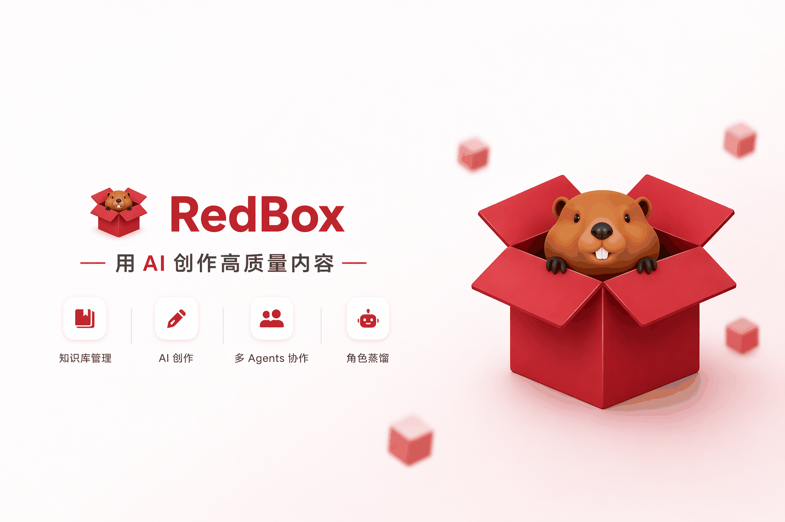
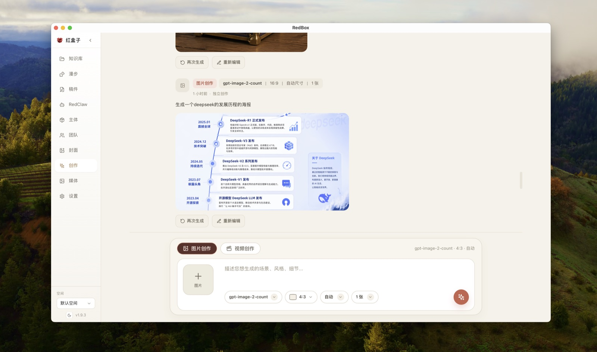

  

  
  &nbsp;
  
  &nbsp;
  

---

  <strong>面向小红书创作者的本地化 AI 创作工作台</strong> 
  <em>知识采集 | 灵感生成 | RedClaw 自动化执行 | 稿件与配图联动 | 后台持续运行</em>

  

  <a href="./readme_en.md">English</a> | <strong>简体中文</strong> | <a href="./readme_tw.md">繁體中文</a> | <a href="./readme_jp.md">日本語</a> | <a href="./readme_ko.md">한국어</a> | <a href="./readme_es.md">Español</a> | <a href="./readme_pt.md">Português</a> | <a href="./readme_tr.md">Türkçe</a>

---

## Star History

<a href="https://www.star-history.com/?repos=Jamailar%2FRedBox&type=date&legend=top-left">
 <picture>
   <source media="(prefers-color-scheme: dark)" srcset="https://api.star-history.com/image?repos=Jamailar/RedBox&type=date&theme=dark&legend=top-left" />
   <source media="(prefers-color-scheme: light)" srcset="https://api.star-history.com/image?repos=Jamailar/RedBox&type=date&legend=top-left" />
   
 </picture>
</a>
## 📋 快速导航

[项目概览](#项目概览) ·
[核心功能](#核心功能) ·
[功能截图](#功能截图) ·
[插件采集](#插件采集) ·
[快速开始](#快速开始) ·
[社区](#社区)

---

## 项目概览

**RedBox (RedConvert)** 是一个面向小红书创作者与内容团队的本地化 AI 工作台，把 **内容采集、知识沉淀、选题发散、稿件生产、自动化执行、主体资产管理、媒体与封面生成** 串成一条完整工作流。

你可以直接从浏览器插件把小红书、YouTube、网页和图片送进本地知识库，再在桌面端完成漫步选题、稿件创作、RedClaw 自动化执行，以及主体 / 媒体 / 封面的统一管理。

## 核心功能

1. **插件采集入库**：浏览器扩展支持保存小红书图文 / 视频、YouTube 视频、网页链接、图片和选中文字，内容会直接进入桌面端工作流。
2. **本地知识库**：统一管理采集内容、文档和素材，支持标签筛选、类型筛选、搜索、封面预览和空间隔离。
3. **漫步选题**：从知识库随机抽取素材做灵感碰撞，生成选题方向，并把结果继续投喂到稿件或 RedClaw。
4. **稿件工作台**：集中管理文件夹、图文稿、视频稿、音频稿和素材，支持 AI 提案、稿件绑定素材、目录组织和统一编辑。  
5. **生图生视频**：支持从文本提示词生成封面图/插图，支持从文本与图片生成短视频稿，产出可直接绑定到稿件发布链路。  
6. **RedClaw 自动化执行**：把单轮对话、技能调用、定时任务、长周期任务和后台 Runner 放在一个入口里持续运行。  
7. **团队协作**：在“团队”里管理成员画像、成员知识、单成员对话和多人群聊协作。  
8. **主体库**：统一沉淀人物、商品、场景等创作主体，后续在写稿、生图、封面时直接复用。  
9. **媒体库**：统一管理 AI 生成图、导入图和计划图，支持按项目、稿件、来源快速过滤和绑定。  
10. **封面工作台**：支持模板图 + 底图 + 标题组的封面生成，也支持让 AI 直接决定封面文案方向。  
11. **后台持续运行**：支持定时、心跳、长周期等自动化模式，让选题、跟进和内容生产可以在后台延续。  

## 功能截图

### 知识库

### 随机漫步

### 稿件工作台

### 创作页（生图 / 生视频）

### RedClaw

### 主体库

### 团队协作

### 媒体库

### 封面图生成

## 插件采集

### 保存小红书内容

### 保存 YouTube 视频

### 保存网页图片

## 快速开始

1. 在 [Releases](https://github.com/Jamailar/RedBox/releases) 下载并安装。
2. 打开 `设置 -> AI`，填写 Endpoint / Key / Model。
3. 选择或创建工作空间，测试连接并保存。
4. 安装并加载 `Plugin/` 里的 Chrome / Edge 扩展。
5. 从 `浏览器插件 -> 知识库 -> 漫步 / 稿件 / RedClaw` 开始完整跑通一次工作流。

## 社区

- [GitHub Issues](https://github.com/Jamailar/RedBox/issues)
- [GitHub Discussions](https://github.com/Jamailar/RedBox/discussions)

## 更新日志

### v1.9.0 (2026-04-04)
- 优化整体 UI 视觉
- 引入 Claude Code 开源版的重要能力
- 增加视频生成功能
- 增加后台值守能力
- 增加飞书、微信机器人通讯能力
- 增强插件采集检测敏感度
- 优化知识库视图
- 优化智囊团成员发言质量
- 修复智囊团成员头像显示错误
- 增加 `subagents` 模式

### v1.8.8 (2026-03-30)
- 采集链路重构，删除内置小红书浏览器，回归浏览器插件采集方案
- 增加公众号文章保存功能
- 优化知识库结构，改为统一视图

### v1.8.7 (2026-03-29)
- 强化长期记忆管理能力，增加动态记忆管理
- 增加用户自媒体档案功能，逐步沉淀创作目标与背景
- 增加主体库管理功能，AI 可在执行过程中自动调用主体参考信息和参考图
- 增强群聊与智囊团成员发言质量
- 增强 AI 工作流稳定性
- 增加调试模式与日志管理能力
- 简化工具列表与工具调用
- 优化漫步深度思考模式，补充 Agent 执行过程状态展示与强制工具轮次约束

### v1.8.5 (2026-03-26)
- 新增知识库导入能力：
  - 支持从 Obsidian 导入知识库
  - 支持批量导入外部知识库
  - 支持上传 PDF、Word、Markdown 等文档
- 新增内置官方模型源，接入支付与会员体系
- 修复视频自动转录、转录错误、智囊团索引刷新、MCP 相关问题
- 修复聊天标签露出导致聊天终止的问题
- 优化页面加载速度与稿件编辑页面 UI 排版

### v1.7.9 (2026-03-22)
- 修复漫步模式 AI 调用链路：
  - 单次调用时显式关闭 Qwen 思考模式，避免无效长时间推理
  - 增强漫步请求日志与超时控制，便于定位模型调用问题
- 优化 RedClaw 工具调用时间线：
  - 工具调用条目压缩为更紧凑的一行小字样式，降低视觉占用
- 优化漫步页头部：
  - 将标题、说明与模式开关融合为单行，整体高度更低

### v1.7.8 (2026-03-21)
- 性能优化（来自 `v1.7.6..HEAD` 提交）：
  - 主进程改为先开窗、再异步初始化后台服务，降低冷启动阻塞
  - App 页面改为懒加载并增加加载占位，减少首屏与切换 Tab 的加载压力
- 设置页模型管理增强：
  - 新增 AI 模型列表拉取与搜索能力，提升模型选择稳定性
- YouTube 采集链路增强：
  - 新增全局剪贴板 YouTube 链接捕获入口
  - 采集前强制执行 yt-dlp 可用性检查
- 发布流程改进：
  - 发布脚本支持自动写入 Release Notes
  - Release Notes 默认提取 README 对应版本条目，缺失时回退到最近提交摘要

### v1.7.6 (2026-03-21)
- 新增首次打开逐步引导（Tippy.js），明确推荐使用顺序
- 漫步结果页新增“开始创作”，可一键把灵感与素材投喂给 RedClaw 自动创作
- 修复左下角版本号显示为旧值的问题，改为动态读取应用版本
- 统一 MCP 客户端版本上报为 package 版本，避免发布后版本不一致

### v1.7.5 (2026-03-21)
- 修复笔记识别与刷新链路
- 增强当前打开笔记优先解析
- 优化图文/视频判定
- 提升采集一致性
